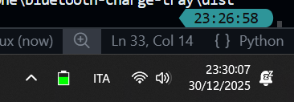

# Bluetooth Monitor



Simple python script (can be built to .exe with pyinstaller) that shows the battery level of your bluetooth devices in the windows system tray.

## Config

Open the app once and open the configuration file at `%APPDATA%\BluetoothMonitor\devices.txt`. Add your devices, one per line, and save the file.

## Build

Requires python (3.12 reccomended), pystray (`pip install pystray`), and pyinstaller (`pip install pyinstaller`).

```bash
# considering you're in the project directory
pyinstaller src/main.py --onefile --noconsole --add-data "scripts;scripts" --name bluetooth-monitor
```
